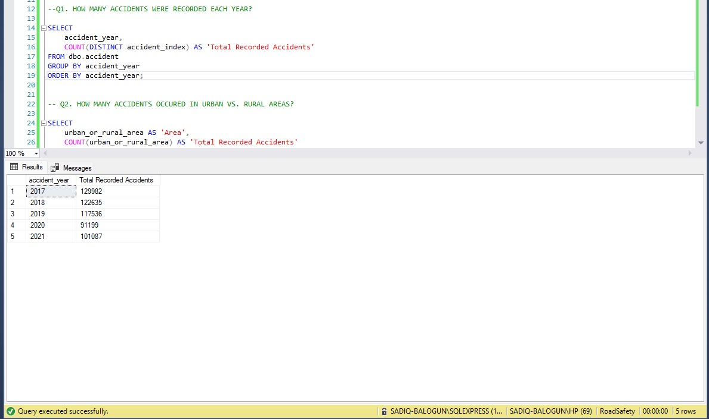
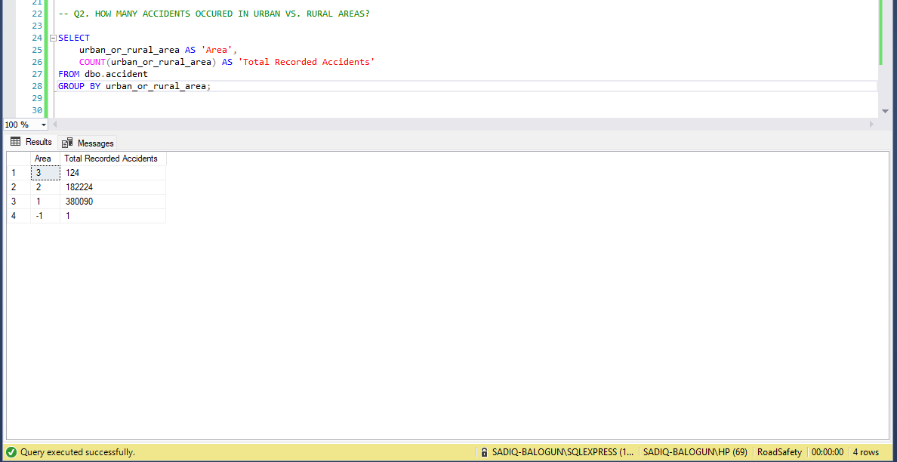
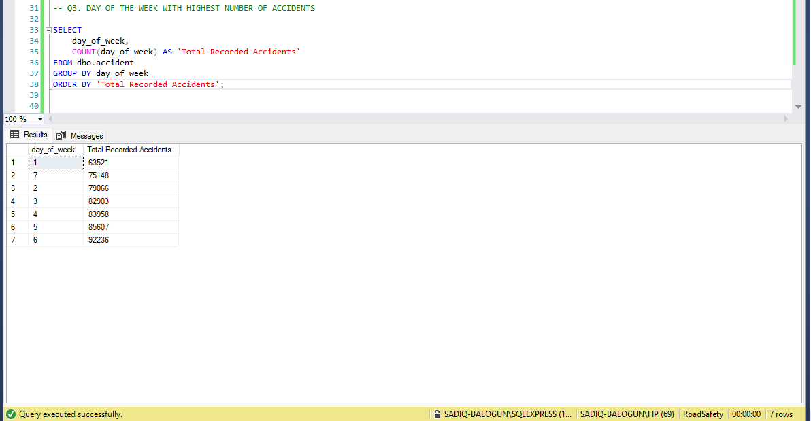
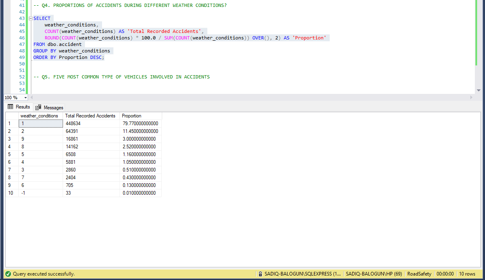
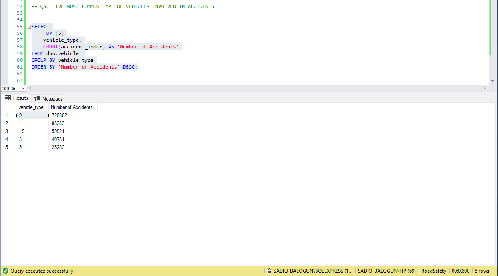
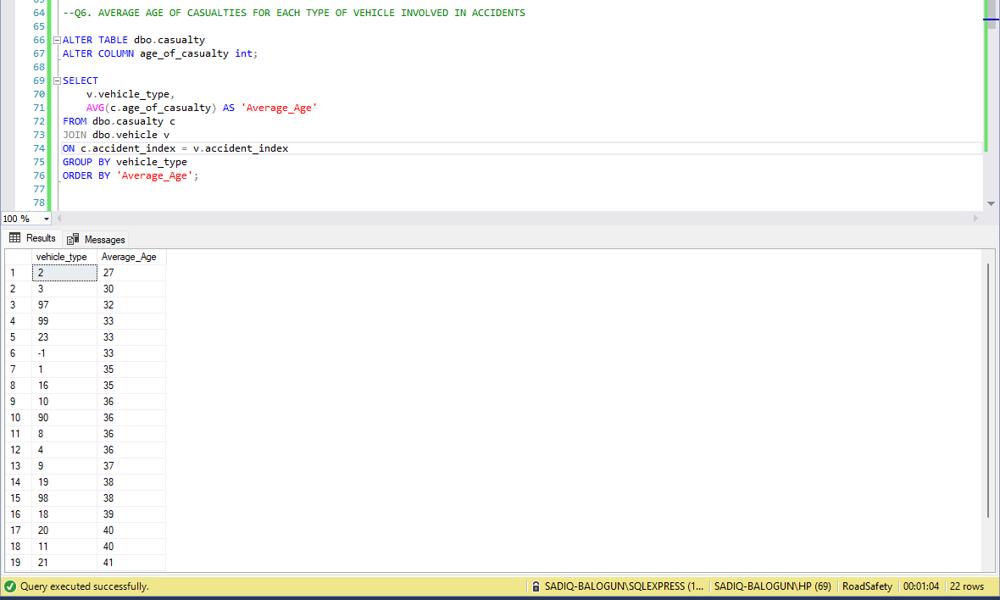
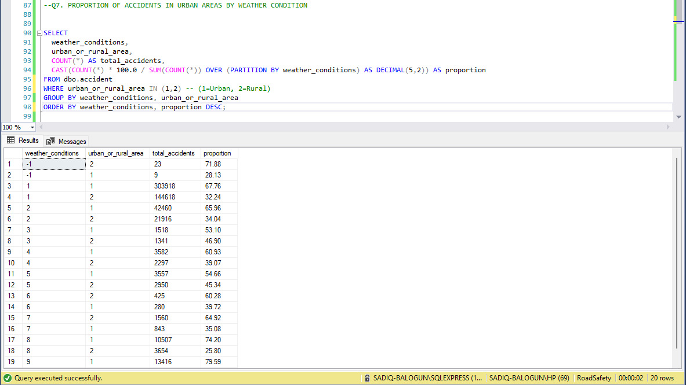
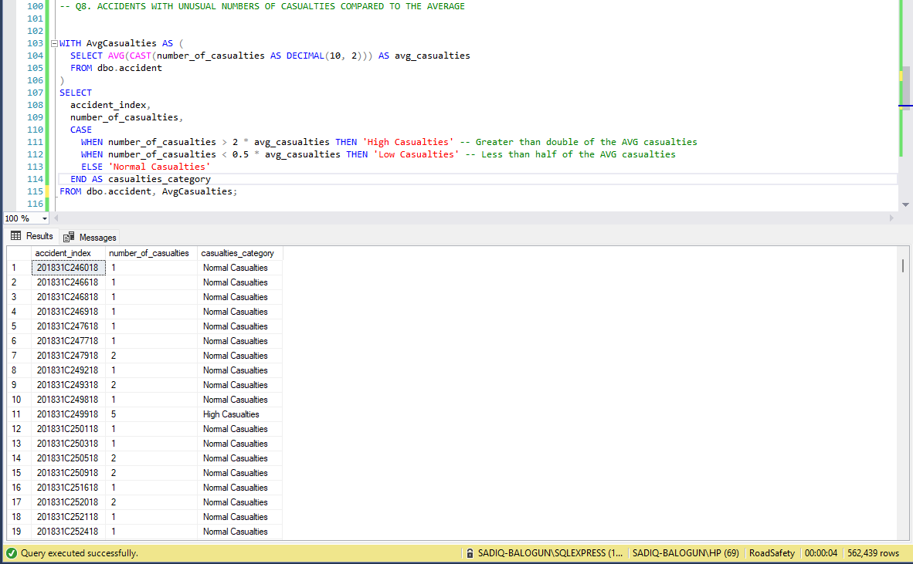
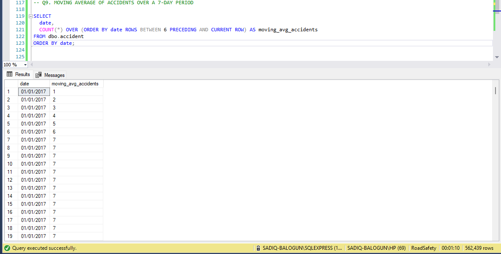
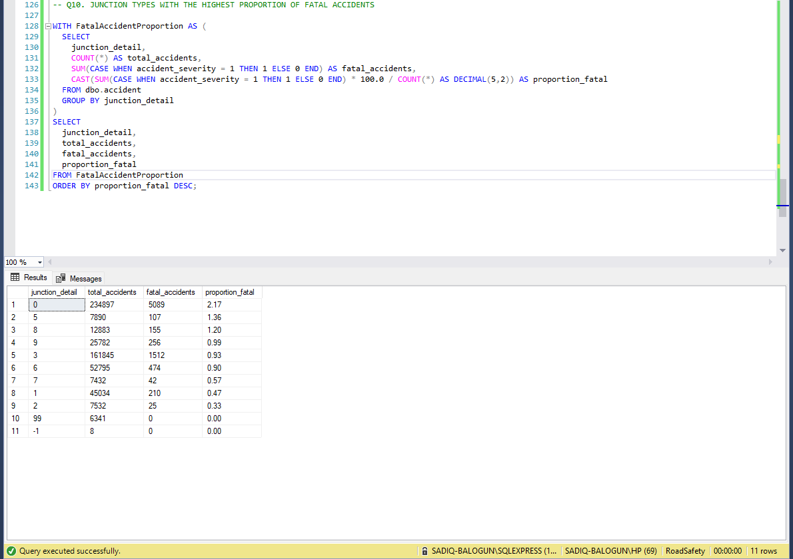

# UK-Accident-Analysis

## Introduction
The global concern over road accidents, which result in significant loss of life and property, necessitates the analysis of accident trends to develop effective preventive measures. In the era of data-driven decision-making, leveraging SQL can provide valuable insights into road accident data.
## Objective
To utilize SQL to provide answers to 10 randomly selected questions, demonstrating my proficiency in using SQL for data analysis.
## RDBMS - Microsoft SQL Server Management Studio
## QUESTIONS
Q1. HOW MANY ACCIDENTS WERE RECORDED EACH YEAR? - 
The result shows that 2017 has the highest number of accidents. I'm noticing the downward trend in the number of accidents.
   

Q2. HOW MANY ACCIDENTS OCCURED IN URBAN VS. RURAL AREAS? - (1=Urban, 2=Rural). We can see that we have more road accidents in the urban areas
   

Q3. DAY OF THE WEEK WITH HIGHEST NUMBER OF ACCIDENTS -  With 1 as Sunday, we can see that most road accidents happened on Friday, and the least happened on Sunday.
   

Q4. PROPORTIONS OF ACCIDENTS DURING DIFFERENT WEATHER CONDITIONS - 80% of the accidents happened in fine weather conditions with no winds.
   

Q5. FIVE MOST COMMON TYPE OF VEHICLES INVOLVED IN ACCIDENTS - Vehicle type 9 -Car is the most common type of vehicle involved in accidents
   

Q6. AVERAGE AGE OF CASUALTIES FOR EACH TYPE OF VEHICLE INVOLVED IN ACCIDENTS -  There is diversity in the average age of casualties for each vehicle type
   

Q7. PROPORTION OF ACCIDENTS IN URBAN AREAS BY WEATHER CONDITIONS - We only have a higher proportion in rural areas than urban areas during "snowing + high winds" and foggy weather conditions
   

Q8. ACCIDENTS WITH UNUSUAL NUMBER OF CASUALTIES COMPARED TO THE AVERAGE
   

Q9. MOVING AVERAGE OF ACCIDENTS OVER A 7-DAY PERIOD - As we can see the increase in number, shows we are going to have a smooth trend
   

Q10. JUNCTION TYPES WITH THE HIGHEST PROPORTION OF FATAL ACCIDENTS - We can see that most accidents happened at 0 - away from junction/within 20 meters of a junction
   

## Conclusion

The exploratory analysis conducted above serves as a testament to my expertise in utilizing SQL for data analysis. Throughout the analysis, I employed a range of techniques including aggregations, JOINs, CTEs, and Sub-Queries to extract valuable insights from the data. By leveraging these advanced SQL functionalities, I was able to uncover hidden patterns, establish connections between different data sets, and derive meaningful conclusions. This demonstrated my ability to employ diverse analytical approaches and showcase the full potential of SQL for in-depth data analysis.

PS: I created a view for Middlesbrough and extracted the data for analysis in Power BI. The dashboard can be found in the link [HERE](https://app.powerbi.com/view?r=eyJrIjoiZjQ5ZDczMWQtM2UwNi00YzYxLWJhODUtYzNhN2UwYmIyNGI2IiwidCI6IjVmZjhkZDRiLTBiZDMtNGRjYS1hNjc2LTgzNmQwN2I0MWNhMSIsImMiOjh9)

Thank you for reading!☺️
